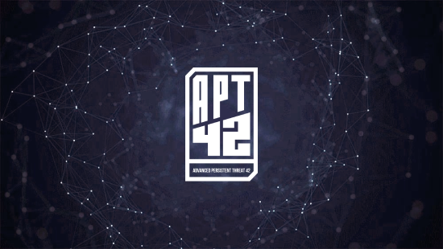
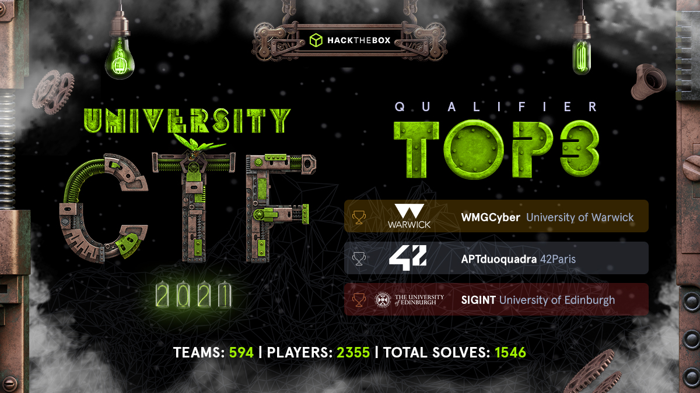
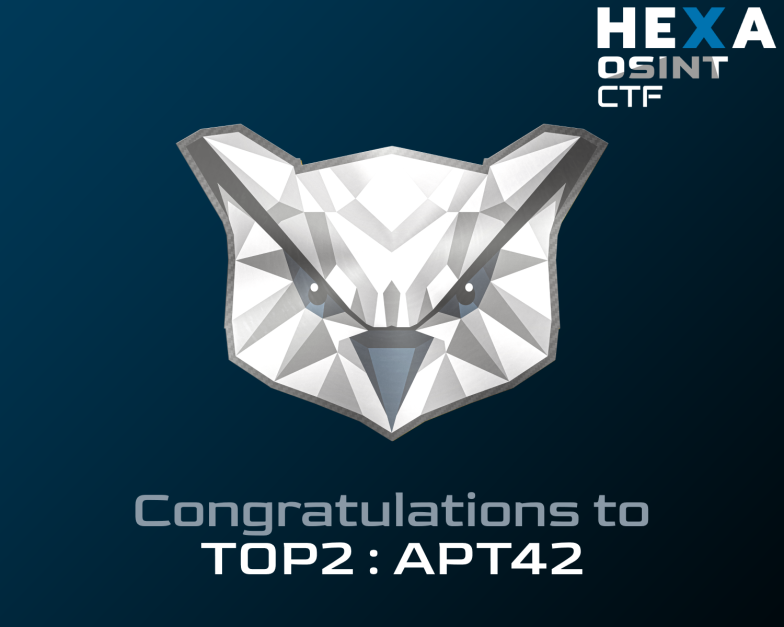

  

<h1 align="center">
  2021 :birthday:
</h1>
<h3 align="center">
  Notre première année !
</h3>

- Première année de l'association qui a été présentée en janvier 2021 avec l'objectif de créer une communauté d'entraide en sécurité informatique pour les DuoQuadras.
- 3 membres au Bureau : agranger (trésorière), clemaist (secrétaire), mboivin (présidente).
- 18 membres actifs : achevron, ajearuth, aldubar, ascholle, avan-pra, bahaas, hbouchet, hmerieux, jandreu, jdidier, lboukrou, macosta, mbenabbo, nbettach, qlouisia, smagdela, therbret, wandre.

## Voici ce qui a été réalisé cette année :

- Rédaction des statuts et de la Charte.
- Création du serveur **Discord**, du [site web](https://apt42.fr/), du **Github**, chaînes [Twitch](https://www.twitch.tv/apt42_club) et [Youtube](https://www.youtube.com/channel/UCsiiU-HqyHesPC4t3mEMZQw), de la page [Linkedin](https://www.linkedin.com/company/apt42/) et du Wiki interne.
- Création du logo par Raphaël Almazan.
- Création de l'équipe université **42paris** sur HackTheBox.

## Pédagogie

Streaming [Twitch](https://www.twitch.tv/apt42_club) hebdomadaire par macosta : **Road to OSCP**  
Vidéos ensuite disponibles sur [Youtube](https://www.youtube.com/channel/UCsiiU-HqyHesPC4t3mEMZQw) avec l'aide de jdidier pour le montage.

**HackTheBox Club** : des sessions en groupe sur Discord, horaires libres.

**OSINT Club par hmerieux** : un rdv hebdomadaire sur Discord pour s'entraîner en OSINT.

**CTF OSINT** par avan-pra, mboivin, therbret et wandre à la fois sur Discord et en présentiel.  
2 sessions : 29-30/05/2021 et 27-28/11/2021 avec 80-100 personnes inscrites.

**Entraînements pour le TRACS** (Viarézo) sur Discord en groupe.

## CTF et Challenges

#### TraceLabs le 6/11/2021
- team lead : hmerieux
- cboutier, hmerieux, nbettach, qlouisa
- résultat : 27/219

  

#### HTB University CTF le 19/11/2021
- nom d'équipe : APTduoquadra
- team lead : therbret
- aldubar, alagroy-, apeyret, arpascal, jmbomeyo, qlouisia, qroland, nbettach, oel-ayad, therbret
- résultat : 2/594

  

#### Hexa OSINT CTF du 3/12/2021 au 5/12/2021
- team lead : Kamyo
- avan-pra, hmerieux, nbettach et Patricia
- nom d'équipe : APT42
- résultat : 2e

#### TRACS par Viarézo le 04/12/2021
- 4 équipes de 42

## Partenariats

**Jumpintech** par Becomtech

**CYB-RI** chez Ileri

## Projets pour 2022

Ateliers à partir de la série Mr Robot par avan-pra, achevron, ajearuth, smagdela.

Starter pack par mbenabbo : aide pour débuter.

Faire participer les DuoQuadras au Hack OPS SAT par CYSAT les 06-07/04/2022.

Organiser une activité inter-asso avec 42l par achevron et mbenabbo.

Partenariat pour organiser une search Party.
