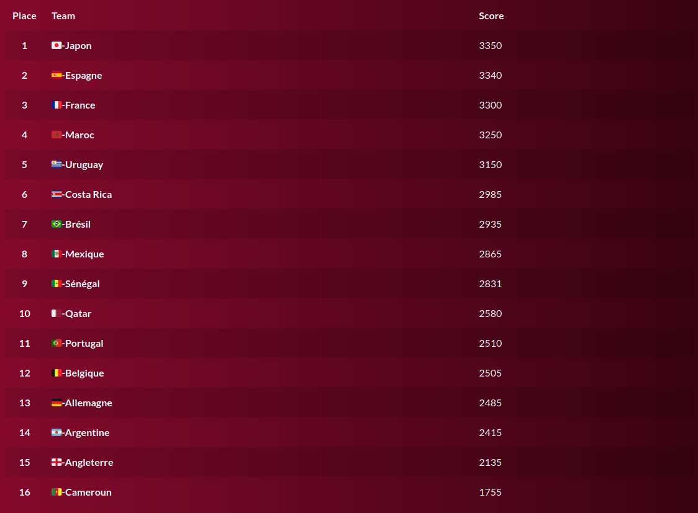
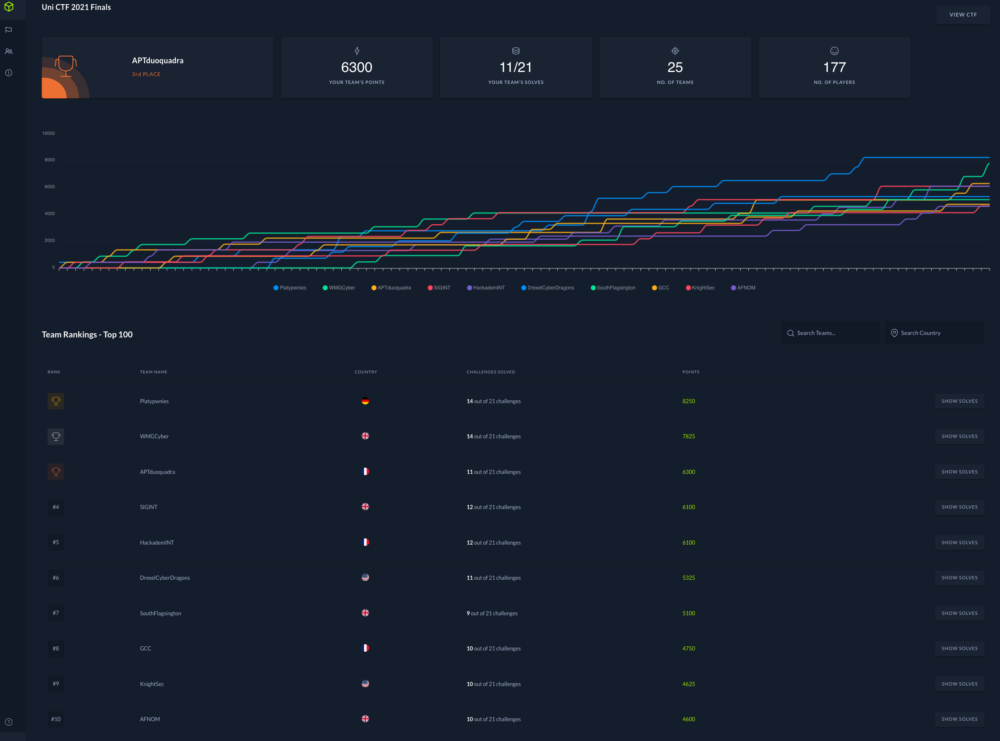
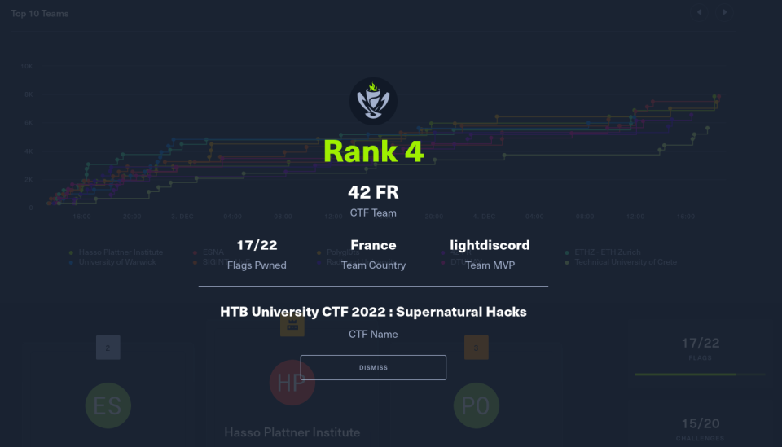

  

<h1 align="center">
  2022 :birthday:
</h1>
<h3 align="center">
  Notre seconde année !
</h3>

- Seconde année de l'association, une passation de bureau courant janvier 2022 avec toujours le même objectif: créer une communauté d'entraide en sécurité informatique pour les DuoQuadras.
- Création du statut de membre actif et mise en place d'un sysème de dotation.
- 3 membres au Bureau : alagroy- (trésorier), achevron (secrétaire) et avan-pra (président).
- 19 membres actifs : achoux, adconsta, ade-tena, akusniak, atardif, chbadad, ewang, fcavillo, jandreu, jmoucach, larmenou, lboukrou, lmalki-h, macosta, mboivin, nbettach, smaccary, therbret et wandre.

## Pédagogie

### Diffusion de la saison 1 de MrRobot
- sur 5 semaines.
- fait par achevron, avan-pra, smagdela, ajearuth.
- diverses activités en fin d'épisode: rump, conférence avec un black hat, quizz, etc.

### CTF OSINT 2: ULTIMATE FOOTBALL HUNT
- Création et organisation de l'évenement au sein de 42.
- 6 mois de préparation à 7.
- fait par mboivin, lpascrea, alagroy-, adconsta, jvaquer, wandre, avan-pra.
- notre plus gros event à ce jour, un CTF OSINT classique + partie irl en mode course d'orientation, des tâches à réaliser pour gagner des points en + etc.

  

### Workshop wifi hacking
- fait par avan-pra.
- un wifi, c'est quoi ? Le protocole, comment ça marche et comment ca se pirate et pourquoi c'est piratable.  

## CTF et Challenges

Toutes les compétitions auxquelles aptduoquadra a pris part cette année (du plus ancien au plus récent).  

- HTB Uni 2021 Finals : 3/25

  

- bleuet aege : 10&12/154
- SAAR ctf : 26/87
- Hero ctf v4 : 30/632
- 404CTF : une demi douzaine de participants
- Bambictf : 29/~60
- Snyk ctf : 28/519
- Phoenix CTF : 3/23
- TRACS : 67/96
- HTB uni 2022 : 4/941

  

## Projets pour 2023

- geoguessr hebdo pour être fort en GEOINT, voir participer à des compétitions.
- faire participer les membres à encore plus de CTF.
